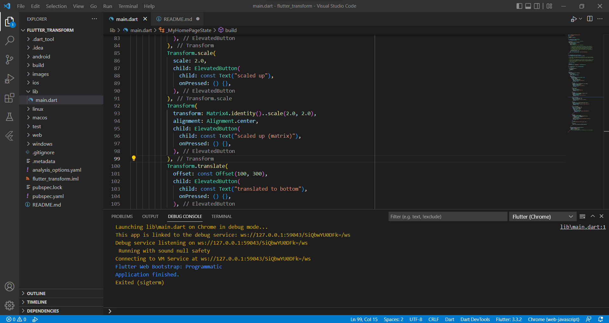
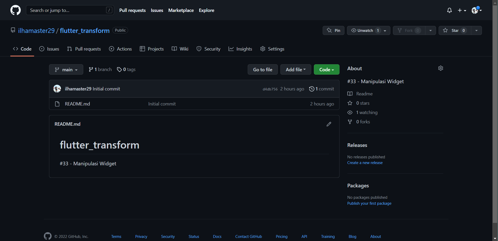
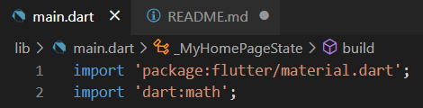
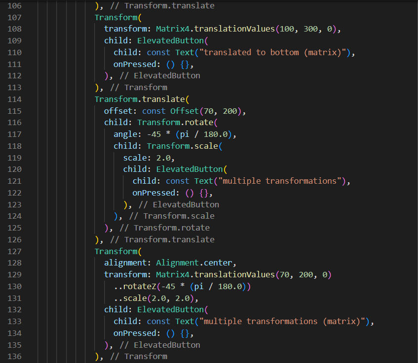
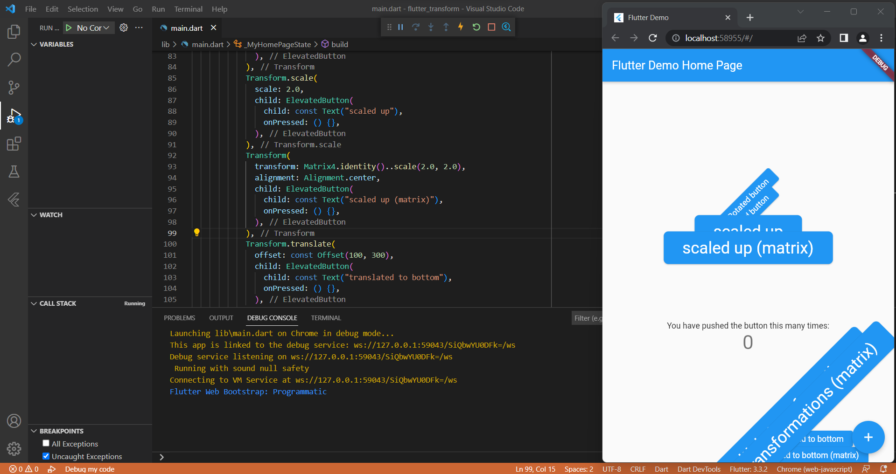
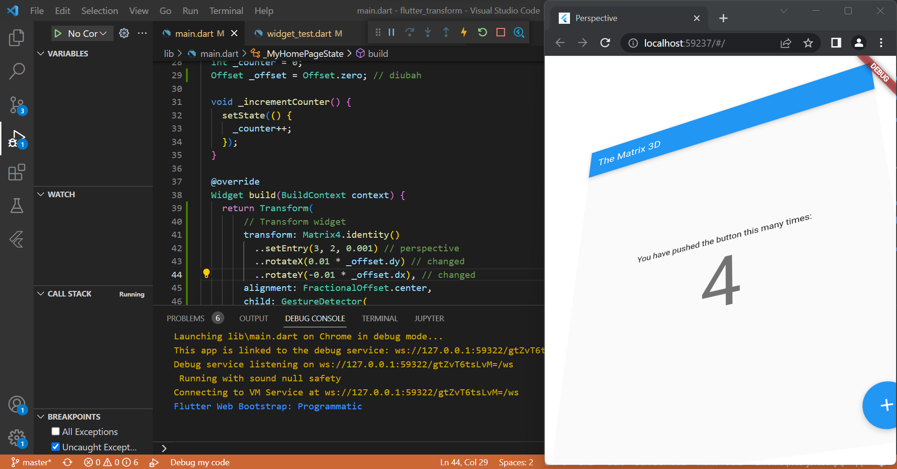

# LAPORAN PRAKTIKUM

## Praktikum Manipulasi Widget

- Buat Project Baru 

> Pembuatan project di vscode dan repository baru di github dengan nama **flutter_transform**.

- Impor dart:math 

> Library dart:math dipanggil untuk menjalankan fungsi matematis dalam kode.

- Tambahkan kode Transform 

Terdapat 4 variasi widget transform dalam project kali ini. Yang pertama rotasi, yang kedua penskalaan, yang ketiga transalasi dan yang keempat translasi sekaligus rotasi.  

- Running project 

> Pada hasil running terdapat banyak button yang saling bertumpukan dengan posisi yang berbeda beda. 

## Perspektif di Flutter

> Pada hasil running, user dapat menggerakkan tampilan sehingga tampak seperti gambar diatas. Ketika layar di tap 2 kali, maka tampilan akan kembali seperti semula (saat awal dijalankan tanpa adanya action / perlakuan).

